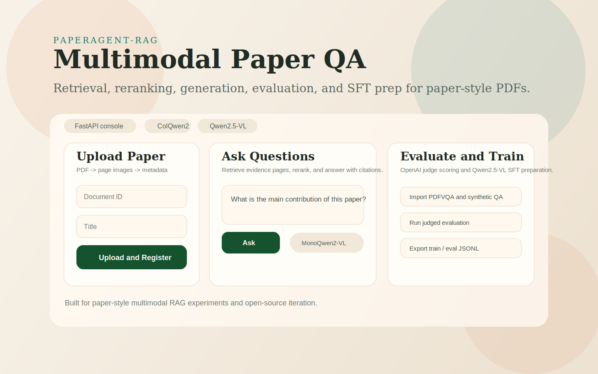
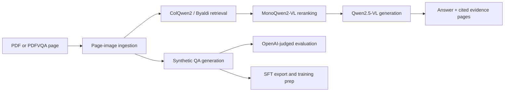

# PaperAgent-RAG

PaperAgent-RAG is an open multimodal RAG starter kit for paper-style PDF question answering.
It combines visual page retrieval, multimodal reranking, VLM answer generation, judged
evaluation, and first-pass SFT data preparation in one repo.



## Why This Repo

Most RAG examples for PDFs still rely on OCR plus text chunking. This project takes a
page-image-first route:

- render PDF pages as images
- retrieve with ColQwen2 late interaction
- rerank with MonoQwen2-VL
- answer with Qwen2.5-VL
- evaluate with GT answers and an OpenAI judge
- export accepted QA pairs for downstream SFT

It is designed for research workflows, quick local demos, and paper-agent experiments.

## Highlights

- FastAPI backend and browser UI for upload, indexing, QA, and evaluation
- local PDF flow and `gigant/pdfvqa` dataset flow
- page-image retrieval with Byaldi + ColQwen2
- optional multimodal reranking with MonoQwen2-VL
- answer generation with Qwen2.5-VL
- synthetic QA generation with groundedness and standalone filtering
- OpenAI-judged evaluation with page-balanced scoring
- SFT export, train/eval splitting, and LLaMA-Factory run packaging

## Project Layout

```text
src/agent_rag/
  api/              HTTP routes
  pipelines/        QA orchestration
  services/         ingest / index / retrieve / rerank / generate / evaluate / storage
  data/             data models
frontend/           lightweight web UI
scripts/            local utilities
configs/            training config templates
docs/               roadmap and SFT plan
```

## System Overview



## Requirements

- Python 3.11+
- macOS / Linux recommended
- enough disk space for model downloads

For the main app:

- `PyMuPDF`
- `Byaldi`
- `Qwen2.5-VL` model downloads

For training:

- a separate SFT environment
- enough memory for LoRA fine-tuning

## Quick Start

### 1. Clone and enter the repo

```bash
git clone https://github.com/DehaoDai/PaperAgent-RAG
cd PaperAgent-RAG
```

### 2. Create the app environment

```bash
make setup-app
```

Or manually:

```bash
python3 -m venv .venv
source .venv/bin/activate
pip install --upgrade pip
pip install -e .
```

### 3. Configure environment variables

```bash
cp .env.example .env
```

Set values as needed:

- `OPENAI_API_KEY` for judged evaluation
- `HF_TOKEN` for faster Hugging Face downloads

`.env` is loaded automatically at startup.

### 4. Start the app

```bash
make run
```

Or manually:

```bash
source .venv/bin/activate
uvicorn agent_rag.main:app --reload
```

Open:

- Web console: `http://127.0.0.1:8000/`
- Swagger UI: `http://127.0.0.1:8000/docs`
- Health check: `http://127.0.0.1:8000/health`

## Demo Flow

### Local PDF workflow

1. Upload a paper in the web UI
2. Build the retrieval index
3. Ask questions
4. Inspect evidence pages and debug output

### PDFVQA workflow

1. Import a slice from `gigant/pdfvqa`
2. Generate synthetic QA pairs
3. Build the retrieval index
4. Run questions or judged evaluation

## Example Commands

### Import PDFVQA

```bash
curl -X POST http://127.0.0.1:8000/datasets/pdfvqa/import \
  -H "Content-Type: application/json" \
  -d '{
    "dataset_name": "gigant/pdfvqa",
    "split": "validation",
    "start_index": 0,
    "limit": 3,
    "document_id_prefix": "pdfvqa"
  }'
```

### Build the retrieval index

```bash
curl -X POST http://127.0.0.1:8000/indices/build \
  -H "Content-Type: application/json" \
  -d '{
    "index_name": "paper_index",
    "model_name": "vidore/colqwen2-v1.0",
    "overwrite": true
  }'
```

### Ask a question

```bash
curl -X POST http://127.0.0.1:8000/query \
  -H "Content-Type: application/json" \
  -d '{
    "question": "What is the main contribution of this paper?",
    "top_k": 3,
    "index_name": "paper_index",
    "use_reranker": false,
    "use_generation_model": true,
    "generation_model_name": "Qwen/Qwen2.5-VL-3B-Instruct"
  }'
```

## Current Endpoints

- `POST /documents/register`
- `POST /documents/upload`
- `GET /documents`
- `POST /datasets/pdfvqa/import`
- `POST /datasets/pdfvqa/synthesize-qa`
- `POST /indices/build`
- `POST /query`
- `POST /evaluations/pdfvqa/run`

## Evaluation

The evaluation flow is:

1. mRAG generates answers
2. an OpenAI judge model compares predicted answers against GT answers
3. each example gets a `1..5` score
4. the score is normalized with `(score - 1) / 4`
5. results are aggregated by:
   - QA-level mean
   - page-balanced mean
   - weighted final score

To use judged evaluation, set:

```bash
OPENAI_API_KEY=...
```

The current judge path supports:

- raw `1..5` scoring
- normalized scoring with `(score - 1) / 4`
- page-balanced aggregation so pages with many QA pairs do not dominate the final result

## SFT Preparation

The repo includes a first-pass SFT pipeline for Qwen2.5-VL.

See:

- [docs/SFT_PLAN.md](docs/SFT_PLAN.md)
- [scripts/export_sft_dataset.py](scripts/export_sft_dataset.py)
- [scripts/split_sft_dataset.py](scripts/split_sft_dataset.py)
- [scripts/launch_sft.py](scripts/launch_sft.py)
- [configs/sft/qwen2_5_vl_pdfqa.yaml](configs/sft/qwen2_5_vl_pdfqa.yaml)

### Export SFT data

```bash
make export-sft
```

This exports accepted QA pairs and filters high-risk layout questions.

### Split train/eval

```bash
make split-sft
```

### Prepare a training run package

```bash
make prepare-sft
```

This creates a run package under:

```text
workspace_data/sft_runs/<run_name>/
```

with:

- `agent_rag_train.json`
- `dataset_info.json`
- `llamafactory_train.yaml`

## Training Environment

Use a separate environment for training so retrieval dependencies and training dependencies do not conflict.

### Create the SFT environment

```bash
make setup-sft
```

Or manually:

```bash
python3 -m venv .venv-sft
source .venv-sft/bin/activate
pip install --upgrade pip
pip install "llamafactory>=0.9.0"
```

### Start a prepared training run

```bash
source .venv-sft/bin/activate
llamafactory-cli train workspace_data/sft_runs/qwen2_5_vl_first_run/llamafactory_train.yaml
```

## Make Targets

- `make setup-app`
- `make setup-sft`
- `make run`
- `make check`
- `make export-sft`
- `make split-sft`
- `make prepare-sft`

## Repository Notes

- `workspace_data/` is intentionally ignored and should not be committed.
- The first run will download retrieval and generation models from Hugging Face.
- Apple Silicon users may see generation fall back to CPU for stability.
- This repository is released under the MIT License.

## Contributing

See [CONTRIBUTING.md](CONTRIBUTING.md) for setup and contribution notes.

## Notes

- The first model downloads can take time.
- On Apple Silicon, Qwen2.5-VL generation may run on CPU for stability.
- Keep `.venv` for the app and `.venv-sft` for training.

## Roadmap

- [docs/ROADMAP.md](docs/ROADMAP.md)
- [docs/SFT_PLAN.md](docs/SFT_PLAN.md)
